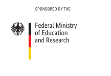

### Release in Kürze!

In dem Projekt wird eine Webanwendung entwickelt, mit der Menschen gemeinsam manuell Sprachaufnahmen verschriftlichen können. Dieser Prozess wird vereinfacht, indem die zu transkribierende Aufnahme automatisiert in kurze, sich an einzelnen Äußerungen (vergleichbar mit Sätzen in der Schriftsprache) orientierende Segmente zerlegt wird, Pausenlängen normalisiert und Bereiche mit Musik oder anderen nicht-sprachlichen Inhalten markiert werden, so dass diese schneller übersprungen werden können.

Durch die Verwendung des kollaborativen Editors [Etherpad-Lite](https://github.com/ether/etherpad-lite) kann dabei einfach erfasst werden, welche Segmente von welchen Nutzer_innen verschriftlicht wurden bzw. welche Segmente noch keine Transkription besitzen. Korrekturen sind (farblich) erkennbar und die ältere Version wird von der neueren verdeckt, geht jedoch nicht verloren.

Desweiteren wird der manuelle Transkriptionsprozess durch automatisierte Spracherkennungssoftware vereinfacht, die für einzelne Segmente Hypothesen erzeugt. Nutzer_innen können die automatisch erzeugten Hypothesen ebenfalls visuell von manuell erzeugten unterscheiden und korrigieren.

Dafür erfolgt die Anbindung von [Kaldi-ASR](https://github.com/kaldi-asr/kaldi)-Modellen (nnet3chain-TDNN) via [kaldi-gstreamer-server](https://github.com/alumae/kaldi-gstreamer-server). Eine Anbindung von [DeepSpeech](https://github.com/mozilla/DeepSpeech/)-Modellen erfolgt derzeit nicht.

Dieses Projekt wurde im Rahmen des Prototypefund im Zeitraum 1. März bis 31. August 2019 vom Bundesministerium für Bildung und Forschung gefördert.

## Aufnahmen, Transkripte und Modelle unter freien Lizenzen

[German Distant Speech Corpus](https://github.com/uhh-lt/kaldi-tuda-de/) (CC-BY 4.0)

  * alle Aufnahmen mit vier verschiedenen Mikrofonen (1 Meter Abstand)
  * Sätze einzeln und unabhängig voneinander vorgelesen

[Spoken Wikipedia Project](https://nats.gitlab.io/swc/) (CC-BY-SA 4.0)

  * uneinheitliche Mikrofonsituation
  * Sprecher_innen lesen ganze Artikel oder Abschnitte aus der Wikipedia
  * automatisch aligniert zur Verwendung für automatisierte Spracherkennung

[Voxforge](http://www.voxforge.org/de/Downloads) (GPLv3), [M-AILABS Speech Dataset](https://www.caito.de/2019/01/the-m-ailabs-speech-dataset/), [Zamia-DE](https://goofy.zamia.org/zamia-speech/corpora/zamia_de/) und [LibriVox](https://librivox.org) (Public Domain)

  * uneinheitliche Mikrofonsituation, jedoch oft mit einem Hinweis in den Metadaten auf das verwendete Mikrofon
  * ganze vorgelesene Bücher (weitestgehend aus dem LibriVox-Projekt) segmentiert in kurze Abschnitte

[Forschergeist-Podcast](https://forschergeist.de/archiv/) (CC-BY-SA 4.0)

  * sehr gute Mikrofonsituation (Radio-Qualität)
  * alle Aufnahmen wurden manuell transkribiert
  * Spontansprache

[Mozilla Common Voice](https://voice.mozilla.org/de/datasets) (CC-0)

  * uneinheitliche Mikrofonsituation, Headsets
  * Sätze einzeln und unabhängig voneinander vorgelesen

Youtube-Crawling via [youtube-dl](https://github.com/rg3/youtube-dl)

  * unterstützt die Suche nach CC-lizenzierten Inhalten
  * unterstützt Unterscheidung zwischen automatisch und manuell erstellten Transkripten

ohne Transkripte:

[Portal Freier Radios](https://www.freie-radios.net/portal/archiv.php) (meist: CC-BY-NC-SA 2.0)

  * sehr gute Mikrofonsituation (Radio-Qualität)
  * teilweise Telefon-/VoIP-Interviews, teilweise Tisch-Mikrofon
  * in der Regel Spontansprache, teilweise Beiträge nach Skript oder vorgelesen
  * vereinzelt auch Vorträge

Vorgelesene Sätze bis hin zu ausdrucksstark vorgelesenen Hörbüchern sind vielzählig vorhanden. Für die Erkennung von Spontansprache muss eine Anpassung erfolgen.
